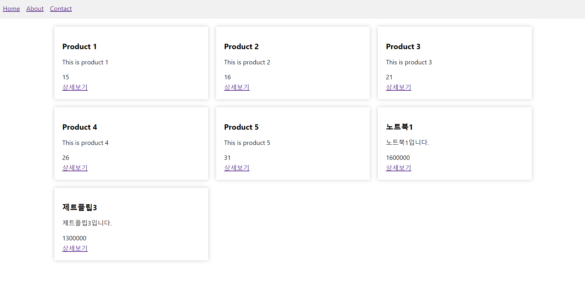

# Tests
이것저것 테스트

```
역할에 따라 각기 다른 폴더에 파일을 분리하여 작성하기.
server, client로 분리
 - server : controller, service, repository 등
 - client : components, services, pages 등
```

## Test1
- 아주 기본적인 게시판 만들기
- 스프링부트에서 리액트로 이어지는 흐름을 파악하려고 테스트함
- 리액트
  - 간단하게 컴포넌트는 하나만
  - `axios`를 사용하여 스프링부트의 API와 통신하여 데이터를 가져옴
  - url 주소를 정확하게 적는 게 중요함
  - css는 피그마를 이용하는 게 좋을 듯? (디자인 신경쓴다면...)
- 스프링부트
  - 서비스는 생략하고 컨트롤러에서 간단하게 구현
  - DB랑 연결하지 않고 하드코딩
- `데이터가 웹에 나타나지 않음`
  - 보안 문제 때문에 웹과 백 서버가 다른 도메인 또는 다른 포트를 사용하는 경우, 브라우저에서는 기본적으로 이를 차단함 (Same-Origin Policy)
  - 해결 방법
    - cors 설정 변경 => 보안상 취약하므로 권장하지 X
    - 프록시 서버
    - API Gateway
  - 실제 웹개발이 아니어서 가장 빠르고 쉬운 cors 설정 변경으로 해결...

## Test2 -> 쇼핑몰 만들기 - 여러 기능 추가할 예정
- 백엔드 구현 => 스프링부트, MySQL
  - [x] 데이터베이스와 연동하는 API 구현
  - [x] 상품 정보를 조회, 등록, 수정, 삭제하는 기능 구현 - 일단 기본만...
  - [ ] 사용자 인증 기능 구현
- 프론트엔드 구현 => 리액트
  - [x] UI/UX 디자인에 따라 웹사이트 구현 - 간단하게 함
  - [x] 백엔드 API와 연동하여 상품 정보를 조회, 등록, 수정, 삭제하는 기능 구현 - 일단 삭제 빼고 구현
  - [ ] 사용자 인증 기능 구현
- 구현 상태 캡쳐
<p align="center"></p>
